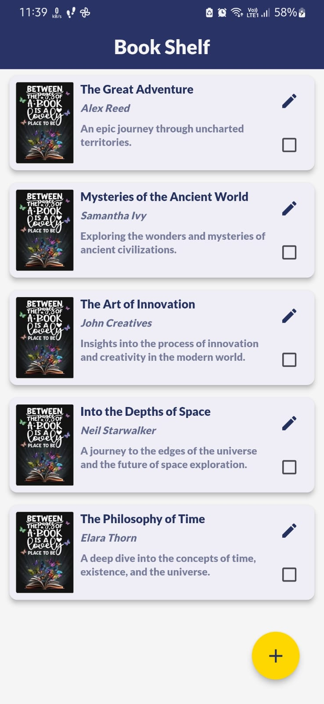

# BookShelf App

The BookShelf app allows users to maintain a personal library, tracking books they've read or want to read. It features a simple, user-friendly interface built with Flutter, supporting basic CRUD operations on books.

## Features

- Add books: Users can add new books to their collection by providing book details such as title, author, and description.
- Edit books: Users can edit existing books to update their details.
- Delete books: Users can remove books from their collection.
- Mark as read/unread: Users can mark books as read or unread to keep track of their reading progress.
- View book details: Users can view detailed information about each book, including title, author, and description.

## Screenshots

## Download

You can download the latest version of the app :

https://drive.google.com/file/d/14TWYr_HRVoR5-mlGAyIQ7K6mJaoP2JwU/view?usp=sharing

### Prerequisites to run

- Flutter installed on your machine
- An IDE (e.g., Android Studio, VSCode, etc.)
- An emulator or physical device to run the app

## Getting Started

To get started with BookShelf, follow these steps:

1. Clone this repository:

  git clone https://github.com/subzero56011/bookshelf

2. Navigate to the project directory:

  cd bookshelf

3. Install dependencies:

flutter pub get

4. Run the app:

  flutter run

5. Running Tests:

flutter test

## Dependencies

- `flutter_bloc`: State management library for Flutter applications.
- `shared_preferences`: Plugin for persisting key-value data on the device.
- `mockito`: Mocking library for Dart to mock dependencies in tests.

## Usage

  To use BookShelf, simply open the app and start managing your book collection. You can add new books, edit existing ones, mark them as read or unread, and delete them by swiping as needed.

## Contributing

  Contributions are welcome! If you find any bugs or have suggestions for improvements, please open an issue or submit a pull request.

